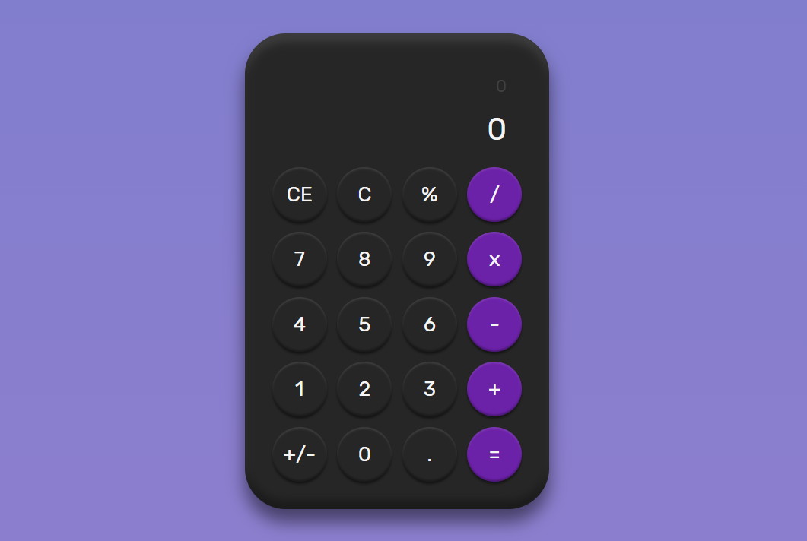

# Calculadora



Esta é uma calculadora simples desenvolvida utilizando as tecnologias React, TypeScript e Tailwind CSS. Ela permite realizar cálculos básicos, como adição, subtração, multiplicação, divisão, cálculo percentual, alteração de sinal do número e limpeza dos dados.

## Funcionalidades

A calculadora possui as seguintes funcionalidades:

- **Adição**: permite somar dois números.
- **Subtração**: permite subtrair um número de outro.
- **Multiplicação**: permite multiplicar dois números.
- **Divisão**: permite dividir um número por outro.
- **Cálculo Percentual**: permite calcular a porcentagem de um número em relação a outro.
- **Alteração de Sinal**: permite alterar o sinal de um número, tornando-o positivo ou negativo.
- **Limpar Dados**: permite limpar todos os dados inseridos na calculadora.

## Tecnologias Utilizadas

- **React**: uma biblioteca JavaScript de código aberto para criar interfaces de usuário.
- **React Vite**: um framework de desenvolvimento rápido para criação de aplicativos React modernos.
- **TypeScript**: um superset do JavaScript que adiciona tipagem estática opcional ao código.
- **Tailwind CSS**: um framework CSS utilitário de baixo nível que permite criar interfaces personalizadas com facilidade.

## Como Executar o Projeto

1. Certifique-se de ter o Node.js instalado em seu sistema.
2. Faça o clone do repositório para o seu ambiente local.
3. Navegue até o diretório do projeto no terminal.
4. Execute o seguinte comando para instalar as dependências:

   ```bash
   npm install
   ```

5. Após a instalação das dependências, execute o seguinte comando para iniciar a aplicação:

   ```bash
   npm start
   ```

6. Acesse a aplicação no seu navegador através do endereço `http://localhost:3000`.

## Contribuição

Contribuições são bem-vindas! Se você encontrar algum problema, ou deseja adicionar uma nova funcionalidade, sinta-se à vontade para abrir um pull request.

## Licença

Este projeto está licenciado sob a licença [MIT](https://opensource.org/licenses/MIT). Sinta-se livre para utilizar e modificar o código conforme necessário.